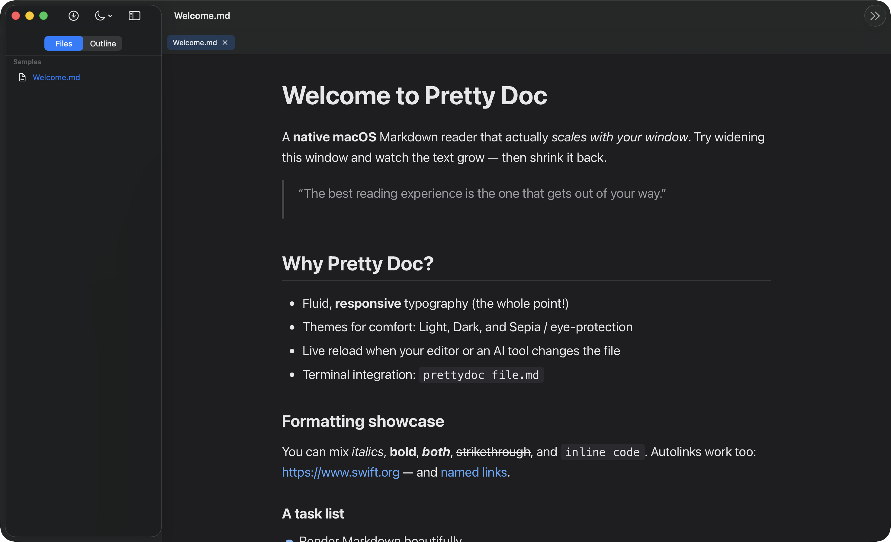

# Pretty Doc

[](https://github.com/erguerra/PrettyDoc/actions/workflows/ci.yml)
[](https://github.com/erguerra/PrettyDoc/releases)
[](LICENSE)
[](#requirements)

A small, fast, **native macOS** Markdown reader with a feature the mainstream
readers refuse to ship: **fluid, responsive typography** that scales with the
window. Widen the window and the text grows; shrink it and the text adapts.
No more tiny text stranded in a huge window.

Pretty Doc is a hybrid app: a native SwiftUI shell (window, toolbar, menus,
preferences, file handling, live-reload, CLI) wrapping a `WKWebView` document
canvas that renders Markdown to HTML/CSS using the OS's built-in WebKit. That
means Obsidian-grade rendering and theming, but as a tiny native `.app` with no
bundled browser (unlike Electron apps).



## Features

- Beautiful Markdown rendering: headings, **bold**/*italic*, links, images,
  tables, task lists, blockquotes, fenced code blocks with syntax highlighting,
  plus **Mermaid diagrams** and **KaTeX math**.
- **Responsive typography** — fluid font scaling tied to window width, plus a
  manual size multiplier, line-height, and letter-spacing controls.
- **Reading width** modes: `Fluid` (fill the window) or `Comfortable` (capped
  measure for long-form reading).
- **Themes** for reading comfort: Light, Dark (follows the system by default),
  and Sepia / eye-protection (warm, reduced contrast).
- **Workspace** — open a folder and browse Markdown files in a sidebar, with
  multiple documents open as **tabs** and a per-document **outline**.
- **Live reload** and **Follow mode** — the view refreshes when a file changes
  on disk, and can auto-scroll to the bottom to watch a document being written.
- **Terminal / AI-tool integration** — a `prettydoc` CLI (with flags, `#anchor`
  deep-links, and stdin streaming) and a `prettydoc://` URL scheme so Claude
  Code, Cursor, and friends can open and deep-link into documents. See
  [docs/INTEGRATIONS.md](docs/INTEGRATIONS.md).

## Install

### Homebrew (recommended)

```bash
brew install --cask erguerra/tap/pretty-doc
```

### Direct download

Download the latest `PrettyDoc-x.y.z.zip` from the
[Releases page](https://github.com/erguerra/PrettyDoc/releases), unzip it, and
move **Pretty Doc.app** to `/Applications`.

> **Note on Gatekeeper:** builds are currently **unsigned** (no Apple Developer
> ID yet). On first launch, right-click the app and choose **Open**, or clear the
> quarantine flag:
>
> ```bash
> xattr -dr com.apple.quarantine "/Applications/Pretty Doc.app"
> ```
>
> Managed / corporate Macs may block unsigned apps entirely via MDM — see
> [docs/DEVELOPMENT.md](docs/DEVELOPMENT.md#enabling-signed--notarized-builds).

## Requirements

- macOS 14 (Sonoma) or later
- Xcode 16 or later (Swift 6) — to build from source
- [XcodeGen](https://github.com/yonaskolb/XcodeGen) (`brew install xcodegen`) to
  generate the Xcode project

## Build & run

```bash
# Generate the Xcode project from project.yml
xcodegen generate

# Build & run from the command line
xcodebuild -project PrettyDoc.xcodeproj -scheme PrettyDoc -configuration Debug build

# ...or just open it in Xcode
open PrettyDoc.xcodeproj
```

The generated `PrettyDoc.xcodeproj` is intentionally git-ignored; `project.yml`
is the source of truth. See [CONTRIBUTING.md](CONTRIBUTING.md) and
[docs/DEVELOPMENT.md](docs/DEVELOPMENT.md) for the architecture overview.

## Terminal integration

Once the app is installed, install the CLI helper (or use **Pretty Doc → Install
Command-Line Tool…** from the menu):

```bash
./Scripts/install-cli.sh
```

This puts a `prettydoc` command on your `PATH`, so you (and AI tools) can run:

```bash
prettydoc README.md
prettydoc plan.md#next-steps     # open and scroll to a heading
some-agent | prettydoc -         # stream an agent's Markdown live
```

The CLI supports flags, `#anchor` deep-links, and stdin streaming, and there's a
`prettydoc://` URL scheme for programmatic control. See
[docs/INTEGRATIONS.md](docs/INTEGRATIONS.md) for the full contract and recipes
for Cursor and Claude Code.

## Project layout

```
project.yml               XcodeGen spec (source of truth for the Xcode project)
App/                      SwiftUI app sources + bundled web canvas
  WorkspaceModel.swift    Tabs, file navigation, URL-scheme routing
  Resources/web/          index.html, app.js, themes.css, vendored JS libs
Scripts/                  prettydoc CLI + installer
docs/                     Architecture (DEVELOPMENT.md) and integration docs
Samples/                  demo Markdown for testing
```

## Roadmap

- Notarized, signed build via GitHub Releases (removes the Gatekeeper prompt).
- Mac App Store build (App Sandbox + security-scoped bookmarks).
- In-document search and print / PDF export.

## Contributing

Contributions are welcome! Please read [CONTRIBUTING.md](CONTRIBUTING.md) and our
[Code of Conduct](CODE_OF_CONDUCT.md). Changes are tracked in
[CHANGELOG.md](CHANGELOG.md).

## License

[MIT](LICENSE) — open source, and free to fork, sell, or build upon.
