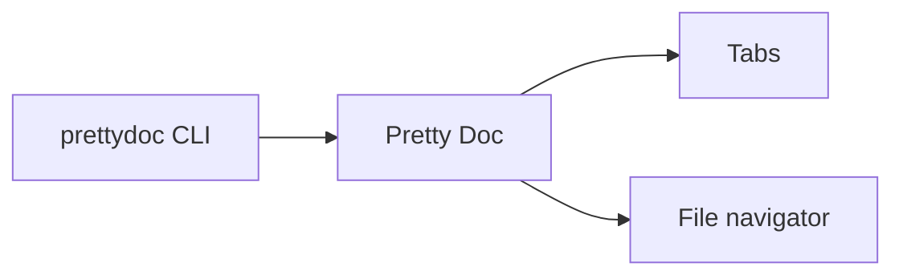

# Welcome to Pretty Doc

A **native macOS** Markdown reader that actually *scales with your window*.
Try widening this window and watch the text grow — then shrink it back.

> "The best reading experience is the one that gets out of your way."

## Why Pretty Doc?

- Fluid, **responsive** typography (the whole point!)
- Themes for comfort: Light, Dark, and Sepia / eye-protection
- Live reload when your editor or an AI tool changes the file
- Terminal integration: `prettydoc file.md`

### Formatting showcase

You can mix *italics*, **bold**, ***both***, ~~strikethrough~~, and `inline code`.
Autolinks work too: https://www.swift.org — and [named links](https://developer.apple.com/documentation/swiftui).

#### A task list

- [x] Render Markdown beautifully
- [x] Scale text with the window
- [ ] Take over the world

#### A table

| Feature            | Obsidian | Pretty Doc |
| ------------------ | :------: | :--------: |
| Responsive text    |    No    |    Yes     |
| Native (no Electron)|   No    |    Yes     |
| Sepia reading mode |  Plugin  |  Built-in  |

#### Code with syntax highlighting

```swift
struct Greeter {
    let name: String

    func greet() -> String {
        // A friendly hello
        return "Hello, \(name)! Welcome to Pretty Doc."
    }
}
```

```python
def fib(n: int) -> int:
    a, b = 0, 1
    for _ in range(n):
        a, b = b, a + b
    return a
```

#### A diagram



#### Some math

Inline math like $e^{i\pi} + 1 = 0$ renders, and so do display equations:

$$
\int_{-\infty}^{\infty} e^{-x^2}\,dx = \sqrt{\pi}
$$

---

Made with SwiftUI + WebKit. Open source under the MIT license.
