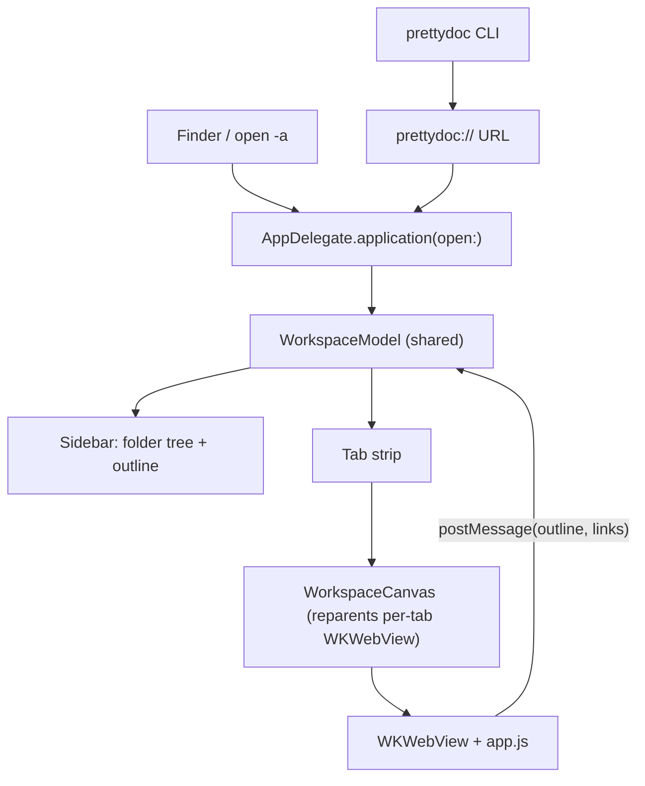

# Architecture & Development

Pretty Doc is a **hybrid** macOS app: a native SwiftUI shell wrapping a
`WKWebView` document canvas. The shell owns the window, tabs, file navigation,
preferences, live-reload, and the CLI/URL-scheme entry points. The canvas (plain
HTML/CSS/JS using the OS's built-in WebKit) does the actual Markdown rendering.

This gives Obsidian-grade rendering and theming without shipping a bundled
browser (unlike Electron), so the app stays small and native.

## High-level flow

## Key types

- **`WorkspaceModel`** ([App/WorkspaceModel.swift](../App/WorkspaceModel.swift)) -
  the single source of truth: open tabs, selection, root folder, and the entry
  points for file/URL opens. A shared instance is used by both SwiftUI and the
  `AppDelegate`.
- **`OpenTab`** - one open document. Owns its own `MarkdownWebController`
  (and therefore its own `WKWebView`), a `FileWatcher`, and the parsed outline.
  Because each tab keeps its web view alive, switching tabs preserves scroll and
  never re-renders.
- **`MarkdownWebController`** ([App/MarkdownWebView.swift](../App/MarkdownWebView.swift)) -
  owns a `WKWebView`, loads `Resources/web/index.html`, and exposes
  `render`, `applySettings`, `scrollToAnchor`, and `setFollow`. Queues JS until
  the page finishes loading. A nested `Coordinator` handles the JS bridge and
  link routing on the main thread.
- **`WorkspaceCanvas`** - an `NSViewRepresentable` container that reparents the
  selected tab's `WKWebView` as its only subview.
- **`ReaderSettings`** ([App/Preferences.swift](../App/Preferences.swift)) -
  persisted reading preferences, serialized to JSON and pushed into the canvas.
- **`FileWatcher`** ([App/FileWatcher.swift](../App/FileWatcher.swift)) - a
  `DispatchSource` file watcher that survives atomic saves (write-then-rename).

## The canvas

[App/Resources/web/app.js](../App/Resources/web/app.js) exposes a small `window.PD`
API (`setContent`, `setSettings`, `scrollToAnchor`, `setFollow`) and posts events
back to Swift via `window.webkit.messageHandlers.bridge` (outline, external
links, relative links). It renders Markdown with `markdown-it`, highlights code
with `highlight.js`, draws diagrams with `mermaid`, and typesets math with
`KaTeX`. Responsive typography is computed from `window.innerWidth`.

Theming is CSS-variable based in [themes.css](../App/Resources/web/themes.css):
a light default, a `prefers-color-scheme` dark fallback, and explicit
`[data-theme]` overrides for Light/Dark/Sepia.

## Building

See [CONTRIBUTING.md](../CONTRIBUTING.md). In short: `xcodegen generate` then
build with Xcode or `xcodebuild`.

## Releases

Pushing a `vX.Y.Z` tag triggers [.github/workflows/release.yml](../.github/workflows/release.yml),
which builds a Release `.app`, zips it, and publishes a GitHub Release with a
SHA-256 checksum. The Homebrew cask in the
[tap](https://github.com/erguerra/homebrew-tap) points at that asset.

Builds are currently **unsigned** (no Apple Developer ID). See the README's
installation notes for the Gatekeeper workaround, and below for enabling
notarization.

### Enabling signed + notarized builds

Add these repository secrets and extend the release workflow:

- `MACOS_CERTIFICATE` / `MACOS_CERTIFICATE_PWD` - base64 Developer ID cert + password
- `APPLE_ID` / `APPLE_TEAM_ID` / `APPLE_APP_PASSWORD` - for `notarytool`

Then codesign the `.app` with the Developer ID, submit with
`xcrun notarytool submit --wait`, and `xcrun stapler staple` before zipping.
